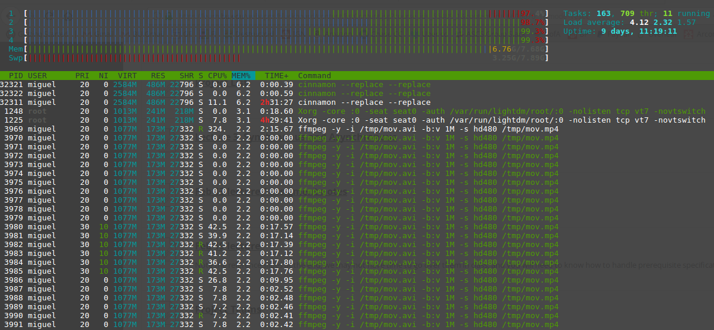

# EC500 exercise 2 - Asynchronous Video Encoding
A python interactive tool which encodes multiple videos 
simultaneously using a combination of multiprocessing and
multi-threading.

## Run instructions
This application implements a [REPL](https://en.wikipedia.org/wiki/Read%E2%80%93eval%E2%80%93print_loop) environment
so simply execute `python main.py` to launch.

Current output format support is `480p` or `720p` at `1Mbps` or `1Mbps`.

## Testing instructions
To run the encoder tests, simply execute `pytest`. You can specify the video path using the `--video_path` switch.
If `ffprobe` is not in your OS program path, you can specify the path to the binary using the `--ffprobe` switch.

### Measuring performance (Part 1 of assignment)
A single instance of `ffmpeg` nearly 100% of cpu usage on a dual core with 2 hardware threads per core.
Therefore, the application only assigns one ffmpeg instance per hardware thread which means only
videos can be encoded at a time.

### TODO
1. Need to add bit_rate tests